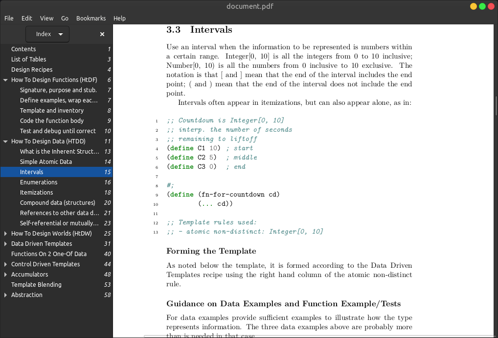

# HtDR-book

A modified latex pdf format of the design recipes from the course: [How to Code: Simple Data](https://www.edx.org/course/how-to-code-simple-data) by [Professor Gregor Kiczales](https://www.cs.ubc.ca/~gregor/).

## Preview

## Installation

The pdf file can be found in [Releases](https://github.com/AshineFoster/HtDR-book/releases) as `document.pdf`. Just download and view with your pdf reader.

## Contribute

Found a typo or a better way to format the document?

Open a pull request or create an issue.

## License

[Attribution-NonCommercial-ShareAlike 4.0 International (CC BY-NC-SA 4.0)](https://creativecommons.org/licenses/by-nc-sa/4.0/)
